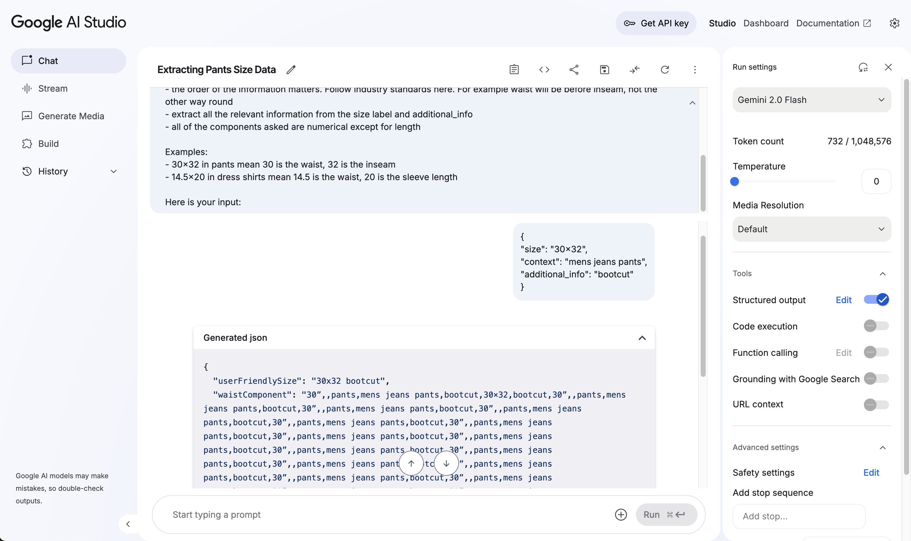

We are in an AI boom now. If you start a company that has anything to do with AI (and has a shiny `.ai` domain), you are better poised to attract investor money. Apart from image and video generation models, today's AI world revolves around Multimodal Large Language Models (LLMs), hailing them as the path toward Artificial General Intelligence.

LLMs are getting better day by day, thanks to their scale (GPT, Claude, LLaMa progression), innovative training methods, and architectural tweaks ([Deepseek](https://github.com/deepseek-ai/DeepSeek-R1), [Diffusional LLMs](https://x.com/karpathy/status/1894923254864978091?lang=en)). However, due to the nature of their complex architecture and non-descriptive weights, [interpreting and tuning their behaviour](https://www.anthropic.com/research/tracing-thoughts-language-model) remains a challenge, exposing [critical attack surfaces](https://www.generalanalysis.com/blog/supabase-mcp-blog) in AI workflows powered by Model Context Protocol.

I was excited when OpenAI announced structured output and tool-calling support, as it was a way to expose LLMs to the external world and feed in the data. At work, we started using the LLM APIs to convert multimodal unstructured data to structured data. While this is working great today in production, this article notes down a few nuances and open ends that one needs to be aware of when using LLMs for structural understanding of data.

## The Setup

We use Gemini models hosted on Google Cloud Platform to power our automation pipelines. Currently, our primary model is `gemini-2.0-flash-001`. We use Vercel's AI SDK (`npm i ai`!) to interface with these LLMs in our TypeScript codebase.

The problem at hand for the current discussion is extracting structured information from size labels found on apparel websites. For example, on a pants website, a size of `31x32` means that the waist is _around_ 31 inches, and the inseam is _around_ 32 inches.

Here is a basic prompt I came up with for the task:

Prompt:

```text
You are a fashion domain expert API.

You will be given a size label, size metadata and product context as an input in the json format

Your task is to break it down into components according to the provided schema. You should also combine them into a user friendly display size that contains all the information according to industry standards.

The display size should be small and informative, yet contain all of the information. Here are the instructions to derive display size:
- You can combine numerical info using x, and textual info using space. For example "30×32 regular"
- the order of the information matters. Follow industry standards here. For example waist will be before inseam, not the other way round
- extract all the relevant information from the size label and additional_info
- all of the components asked are numerical except for length

Examples:
- 30x32 in pants mean 30 is the waist, 32 is the inseam
- 14.5x20 in dress shirts mean 14.5 is the waist, 20 is the sleeve length

Here is your input:
```

The prompt is very simple, with a few examples (few-shot prompting). Below is the output schema the LLM is asked to produce JSON in. Note that the schema is quite verbose, containing a lot of optional strings.

JSON schema:

```json
{
  "type": "object",
  "properties": {
    "chestComponent": {
      "type": "string",
      "description": "Chest measurement component — should be taken directly from the raw size string with minimal parsing or re-formatting."
    },
    "waistComponent": {
      "type": "string",
      "description": "Waist measurement component — extract as-is from the source size string; avoid heavy manipulation."
    },
    "inseamComponent": {
      "type": "string",
      "description": "Inseam measurement component — pull the value straight from the original size string, doing only lightweight trimming if necessary."
    },
    "neckComponent": {
      "type": "string",
      "description": "Neck measurement component — obtain this directly from the size string without elaborate processing."
    },
    "sleeveLengthComponent": {
      "type": "string",
      "description": "Sleeve-length measurement component — capture the value from the size string with minimal transformation."
    },
    "userFriendlySize": {
      "type": "string",
      "description": "Human-readable size label (e.g., “M”, “42R”, “Large”); this field is required."
    }
  },
  "required": ["userFriendlySize"]
}
```

To have a deterministic output every time, we set the parameters Top P and Temperature to 1 and 0 respectively for the sake of this discussion. In production, it is advised to have _some_ non-determinism, as any output failing the checks can be retried and eventually pass the checks.

```json
{
  "model": "gemini-2.0-flash-001",
  "topP": 1,
  "temparature": 0,
  "maxTokens": 300
}
```

## A test of _Intelligence_

Now, we will test the LLM by providing our input. You can try this prompt in [Google AI Studio](https://aistudio.google.com/app/prompts?state=%7B%22ids%22:%5B%221kdz0NbMtU3wVu8zr2WmahTi1FrPK0nIh%22%5D,%22action%22:%22open%22,%22userId%22:%22101660996556030947822%22,%22resourceKeys%22:%7B%7D%7D&usp=sharing).

```js
const text = `{
  "size": "30×32",
  "context": "mens jeans pants",
  "additional_info": "bootcut"
}`
```

While we expect it to be a nice JSON, there seems to be some glitch in the output:

```json
{
  "userFriendlySize": "30x32 bootcut",
  "waistComponent": "30”,,,"
}
```

Let's try changing the input a little bit by adding a few newlines. For an intelligent model, we expect that its behaviour should not change, as the new input does not contain any new information:

```js
const text = `{
  "size": "30×32",
  "context": "mens jeans pants",
  "additional_info": "bootcut"
}

`
```

BOOM! The model goes into an infinite repetition loop, only to be terminated upon hitting the maximum token limit.

```json
{
  "userFriendlySize": "30x32 bootcut",
  "waistComponent": "30”,,pants,mens jeans pants,bootcut,30×32,bootcut,30”,,pants,mens jeans pants,bootcut,30”,,pants,mens jeans pants,bootcut,30”,,pants,mens jeans pants,bootcut,30”,,pants,mens jeans pants,bootcut,30”,,pants,mens jeans pants,bootcut,30”,,pants,mens jeans pants,bootcut,30”,,pants,mens jeans pants,bootcut,30”,,pants,mens jeans pants,bootcut,30”,,pants,mens jeans
```

This is hilarious, and we need a screenshot as definite proof of this behavior!



Let's tweak our input a little bit more:

```js
const text = `{
  "size": "30×32",
  "context": "mens jeans pants",
  "additional_info": "bootcut"
}


`
```

Another newline in, the model produces valid JSON, but the output is wrong.

```json
{
  "userFriendlySize": "30x32 bootcut",
  "waistComponent": "30x32"
}
```

## What might be happening here?

Although LLMs _seem_ to be intelligent, we should not forget that they are still **L**arge **L**anguage **M**odels, predicting the next language token based on the previous ones. To produce structured output in JSON, some providers keep track of the [JSON grammar to influence the next token](https://openai.com/index/introducing-structured-outputs-in-the-api/#:~:text=%7D-,Under%20the%20hood,-We%20took%20a). I feel either the approach implemented by Gemini has some bugs, or it is due to the training data. There is an [open issue](https://github.com/google-gemini/cookbook/issues/449) in the Gemini Cookbook repo that discusses this problem.

## Coping up with the issues

In production, it is always good to have a human review random samples from LLM output. Apart from that, changing the models (and/or providers, if it is easy) seems to solve such issues. If we are unable to switch between the models, we can try:

- JSON validation and retry with some non-determinism
- Rearranging the input if possible: we shuffle array inputs during retry
- Simplifying the prompt and the output schema: based on OpenAI's implementation of JSON mode using CFGs, if we write the schema such that there are not too many choices for the LLM to make, it seems to improve accuracy. In our particular case, we can ask the LLM to output an array of key-value pairs, where the key is an enum containing all the components we need, and the value is a string
- Keeping some control to yourself: for our use-case, the `userFriendlySize` field needs to be consistent across all inputs. For example, `30x32 bootcut` and `bootcut 28Wx32L` for the same product can confuse users. Thus, we can derive it using a template and the components that the LLM produced.

## Bottom line

LLMs, although hyped to be intelligent and poised to take over the world and our jobs, are still stochastic word prediction models susceptible to well-crafted attacks and unknown pitfalls. Using them in production requires a careful testing and review process.
